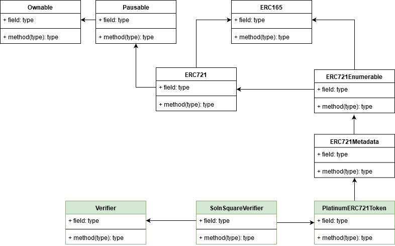

# Platinum Token - Capston Project

The capstone will build upon the knowledge we have gained in the Udacity course in order to build a decentralized housing product. 

## Introduction

In this project we´ll be minting platinum tokens to represent titles to the properties. We´ll use zk-SNARKs to create a verification system which can prove you have title to the property without revealing that specific information on the property. 
Once the token are verified and minted we will place them in a blockchain market place (OpenSea) for others to purchase

## Tests

1. Start ganache-cli:

`ganache-cli -m "candy maple cake sugar pudding cream honey rich smooth crumble sweet treat" -l 9999999 -e 500`

Please note the tests were run using `Ganache CLI v6.5.0 (ganache-core: 2.6.0)`

Use any of the following options:

2. TestERC721Mintable -> `npm run test721`
3. TestSquareVerifier -> `npm run testsqver`
4. TestSolnSquareVerifier -> `npm run testsolnver`
5. All tests -> `npm run testall`

__Note__: Since truffle root dir is on repo root dir, the following parameters were added to truffle-config.js:
```
  contracts_directory: "./eth-contracts/contracts/",
  contracts_build_directory: "./eth-contracts/build/",
  migrations_directory: "./eth-contracts/migrations/",
  test_directory: "./eth-contracts/test/",
```

## Deployment on Rinkeby

- __Verifier__ (0x8a13E530Bf3D26D5D64d7c5562a2D32CB769C39b), created on tx: 0xf20e11304c192d5af6032ca7a10c358010910a1f5966589d0f04d6eb4912db6c
- __PlatinumERC721Token__ (0xD0c75A4B8Ba44F75D715daA431A172AcD17A6cbc) created on tx: 0x203032d2109c6407aebd4d8db20dca0c95abd8b2820d75f8930fb04073600d42
- __SolnSquareVerifier__ (0xa686653F769E37576eA7993AB0778690D90FCc34) created on tx: 0x6ef362984b17fda36320c40aa2cd9985e2bb2e4d642a9dc59a9d39e731d122a2c 
Contract´s ABI can be found in [documents](./documents)

## Minting

- 10 tokens were minted through https://vintage.myetherwallet.com/#contracts with contract __SolnSquareVerifier__ with TokenId: 19841, 19842, ... , 198410.
- 10 more tokens were minted using the mint.js by OpenSea. https://github.com/ProjectOpenSea/opensea-creatures with TokenId: 1-10.  (More info on how to use this script in this [section](#How-to-use-mint.js-by-OpenSea))
- Only tokens 1-5 have metadata available so far.
- [List](https://rinkeby.etherscan.io/token/0xa686653f769e37576ea7993ab0778690d90fcc34?a=0x09c9d084de851c2f8b08fff5cee78c5cb3ace338) of mint operations by owner and holder. 

## OpenSea market place

OpenSea is a decentralized marketplace that is used for selling for crypto assets such as CryptoKitties and other digital assets that are powered off Ethereum. On OpenSea, you can buy or sell any of these items through a smart contract, meaning that no central authority ever holds custody of your items. You can even check out the source code for this smart contract here.

Find [Platinum Market](https://rinkeby.opensea.io/assets/platinum) in OpenSea for SolnSquareVerifier tokens.

- 5 tokens were listed by 0x09C9D084De851c2f8B08FfF5CEe78c5Cb3acE338: 198410, 19849, 19848, 19847, 19846
- 0x6b002BfD1506c022786A36B3deB0dAeF1fe1CfcA bought the aforementioned tokens. Check [here](https://rinkeby.etherscan.io/token/0xa686653f769e37576ea7993ab0778690d90fcc34?a=0x6b002bfd1506c022786a36b3deb0daef1fe1cfca) the balance of this account.

Please notice only tokens from 1-5 have metadata available so far.

## How to use mint.js by OpenSea

In this project, the script was only used for minting new tokens with the following steps:

1. Clone the project from https://github.com/ProjectOpenSea/opensea-creatures
2. Set environment variables used by the script.
```
npm install
export INFURA_KEY="your Infura project Id"
export MNEMONIC="contract´s owner account mnemonic"
export OWNER_ADDRESS="contract´s owner address"
export NFT_CONTRACT_ADDRESS="NFT contract address which will be used for minting"
export NETWORK="rinkeby"
```
3. Open mint.js and add you contract´s abi under NFT_ABI constant.
4. In mint.js main function, check your contract´s mint function __name__ and __parameters__ under the NFT_CONTRACT_ADDRESS clause.
5. Set the NUM_CREATURES constant at the begining of the script with the number of tokens you want to mint.
6. run ``node scripts/mint.js`` and enjoy.


## Contract Classes




# Project Resources

* [Remix - Solidity IDE](https://remix.ethereum.org/)
* [Visual Studio Code](https://code.visualstudio.com/)
* [Truffle Framework](https://truffleframework.com/)
* [Ganache - One Click Blockchain](https://truffleframework.com/ganache)
* [Open Zeppelin ](https://openzeppelin.org/)
* [Interactive zero knowledge 3-colorability demonstration](http://web.mit.edu/~ezyang/Public/graph/svg.html)
* [Docker](https://docs.docker.com/install/)
* [ZoKrates](https://github.com/Zokrates/ZoKrates)
